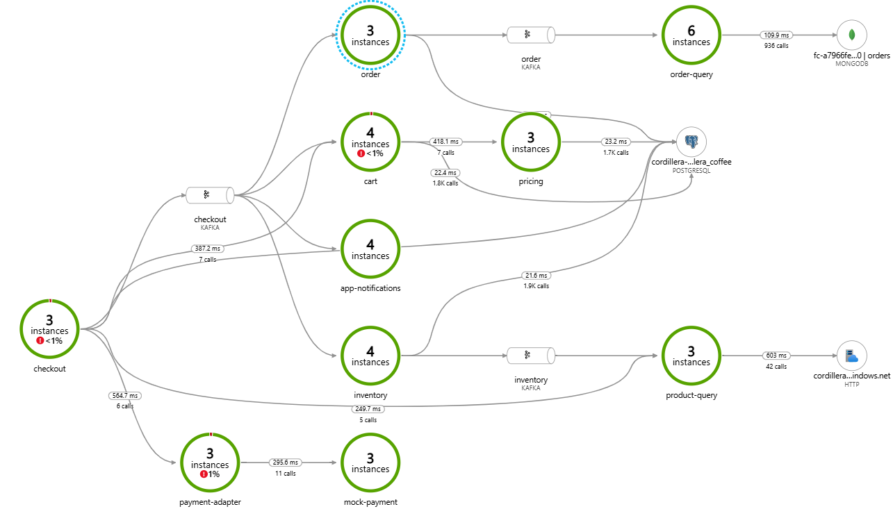

## About me

Hi there 😀 I'm David Cediel. I'm a Backend Developer with 3+ years of experience building applications with Java ☕ and Spring Boot 🍃

### Tech Stack 

 

## Projects 

### [Coffee e-commerce ☕](https://github.com/stars/davidcediel12/lists/coffee-e-commerce-project)

🚀 Designed and implemented a cloud-native microservices system for a coffee e-commerce, applying SAGA, CQRS, and event-driven architecture. Integrated Azure Search, Kafka, and multiple databases (MongoDB & PostgreSQL).

Below are the microservices diagram generated by Azure Insights 

### [Pet Adoption Project](https://github.com/stars/davidcediel12/lists/pet-adoption-project)

In this full-stack project, I am building a web page to adopt pets! It uses **Angular** and **Spring Boot** (with a microservices architecture)

### Hackathons

I've participated in multiple Hackathons, these are the main ones:

- [Caixa - Hackathon "Hack is on"](https://github.com/davidcediel12/hackathon-hack-is-on): Built a system that simulates a blockchain 
- [Inditex Hackathon](https://github.com/davidcediel12/inditex-hackathon): Built a logistics e-commerce API
- [Caixa - Hackathon "The game is on"](https://github.com/davidcediel12/hackathon-the-game-is-on): Built a Banking API 

### Contact 

Feel free to contact me through:

- email: esdago18@gmail.com
- [LinkedIn](https://www.linkedin.com/in/david-cediel/)

